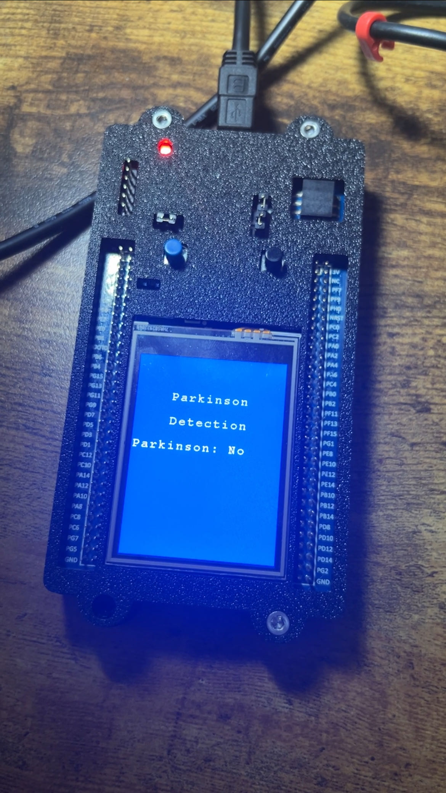
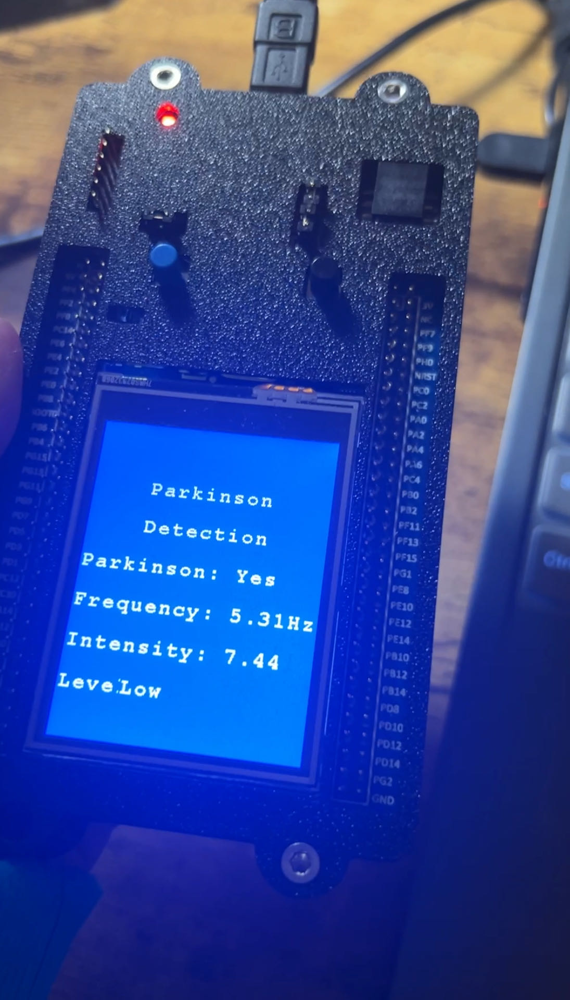
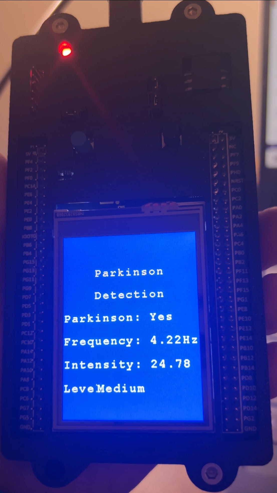

This is an embedded system project Parkinsonian Tremor Detection System at NYU course Embedded System.

The first task is to read gyro values from the board. 

Then use FFT to analyze the frequency components of gyroscope data obtained from the sensor. Apart from simple fast FFT, I also make further modifications to first preprocessed the gyro data using low-pass and high-pass to remove noise and unwanted frequency components. 

The third task is to determine if the tremor is present and it’s intensity. I first used the peak detection which only observe the maximum magnitude value to determine but it did not work well. Thus I considered a creative peak prominence algorithm that considers not only the magnitude of the peak but also its significance relative to neighboring frequencies. When it exceeds a the threshold, the peak is considered significant. And if such a peak is detected within the tremor frequency range and its prominence exceeds the threshold, a Parkinsonian tremor is detected. And also I made three levels to mark the intensity of the Parkinson based on their intensity values compared to 15 or 25.

The fourth task is to show the information on the board, in which I used the LCD to finish this task. 

Here are some actual tests on the board. 

For the board that is keeping still on the table, the Parkinson is detected as "no". 

For small trembling as a Mild Parkinson's patient, the level is detected as low with other outputs like frequency and intensity values.

For more severe trembling, the level is detected as medium also with outputs of other values. 

